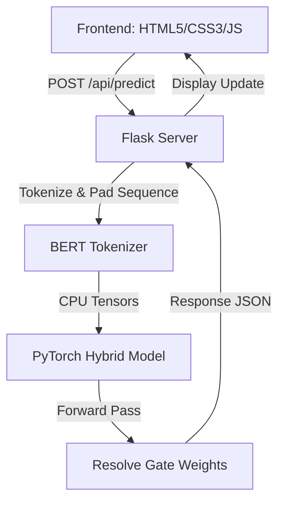

# One Model for All: Domain-Agnostic Recommendation System Dashboard

[](https://github.com/HARISHPG21/LLMRec-Dashboard)
[](#)
[](#)
[](#)

This repository contains the interactive research dashboard for **One Model for All: Large Language Models Are Domain-Agnostic Recommendation Systems** (published in *ACM Transactions on Information Systems (TOIS)*, Vol. 43, No. 5, July 2025).

The dashboard connects a fully functional **PyTorch hybrid sequential model** with an advanced **Frosted-Glass UI** to simulate cross-domain user sequence recommendations and explore collaborative-semantic gating metrics in real-time.

---

## ⚡ Key Visual & Interactive Features

### 🎮 1. Multi-Domain Recommendation Simulator
* **Interactive Timeline**: Mix purchase histories across multiple domains (Scientific, Office, Instruments, Pantry, Arts) to build a custom chronological user timeline.
* **Timeline Reordering**: Adjust sequence ordering in real-time using built-in swap (`◀` and `▶`) controls to observe how purchase order changes model attention.
* **Live CPU Inference**: Fetches real-time gating outcomes, top recommendations, and dynamic weights from the PyTorch backend.

### ⚖️ 2. Gating Sandbox & Neural Flow Visualizer
* **Manual Gating Override**: Tune the gating parameter $\sigma$ from $0.0$ (100% semantic LLM text representations) to $1.0$ (100% collaborative sequence patterns) to re-rank target candidates in real-time.
* **Score Accordion Details**: Expand any candidate to inspect its individual collaborative score (purple bar) and semantic cosine similarity score (cyan bar).
* **Neural Visualizer**: Animated pulse particles trace information propagation routes through the dual encoders during inference runs.

### 🌀 3. t-SNE Embeddings Space
* **Semantic vs. ID Clustering**: Toggle between *LLM-Rec (Semantic)* clustering and *IDRec (ID)* scattering to visualize how text-based features align item structures across domains.
* **Search Highlight**: Search for keyword terms (e.g. `mic`, `pen`, `stethoscope`) to highlight matching points with neon pulses and text labels on the canvas.
* **Responsive Coordinate Mappings**: Hover coordinates auto-scale to ensure tooltips display accurately on mobile, tablet, and desktop viewports.

### 🔥 4. Cross-Domain Transfer Heatmap
* **Synergy Grid**: Explore zero-shot transfer learning Recall@10 improvement percentages on an HSL-colored grid.
* **persistent Click Lock**: Click on cells to lock detail cards displaying dataset user overlap counts and textual cosine similarity metrics.

### 🧠 5. Backbone Scaling Explorer
* **Dual Comparison Mode**: Select a primary backbone (e.g. `BERT-Base`) and enable Compare Mode to choose a second model (e.g. `OPT-1.3B`). Renders side-by-side performance cards and side-by-side bar charts comparing latencies.

---

## 🏗️ Architecture



---

## ⚙️ Installation & Setup

### Prerequisites
* Python 3.8+
* Node.js v18+ (optional, for code inspections)

### 1. Clone the Repository
```bash
git clone https://github.com/HARISHPG21/LLMRec-Dashboard.git
cd LLMRec-Dashboard
```

### 2. Install Python Dependencies
```bash
pip install -r requirements.txt
```
*(Requirements include `torch`, `transformers`, `flask`, `numpy`, `scikit-learn`)*

### 3. Load Checkpoint and Datasets
Ensure your preprocessed dataset and model checkpoints are placed inside the project root:
* Model checkpoint: `ckp/valid_best.pth`
* Datasets directory: `dataset/`
* Metadata: `local_dataset/meta_datas.pkl`

### 4. Start the Inference Server
```bash
python server.py
```
*(The server will load parameters, compile embeddings on the CPU, and listen at `http://127.0.0.1:8000`)*

### 5. Access the Dashboard
Open your browser and navigate to:
👉 **[http://localhost:8000](http://localhost:8000)**

---

## 📄 License
This repository is licensed under the MIT License - see the [LICENSE](LICENSE) file for details.
